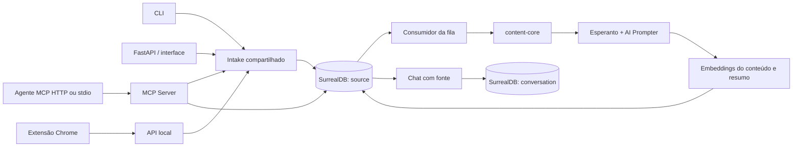

# Arquitetura e dados

O pacote Python se chama `signal_inbox` para não sombrear o módulo `signal` da biblioteca padrão. O executável instalado é `signal`.

## Persistência

O schema idempotente está em `src/signal_inbox/schemas.surrealql`, incluído no pacote instalado. A inicialização executa e verifica cada declaração individualmente. SDK `surrealdb` 2.0 ou superior é necessário para o servidor 3.x; as operações de registro são normalizadas no adapter porque algumas devolvem listas.

- **`source`**: URL/nome original, fingerprint, título, conteúdo extraído, metadados, resumo e seu idioma/modelo, timestamps, estado, etapa, erros e tentativas. `chunks` contém os trechos completos, offsets e seus vetores. `summary_embedding` contém o vetor do resumo, separado dos vetores de conteúdo. Provider/modelo/dimensões dos embeddings são registrados.
- **`conversation`**: cada registro guarda um turno completo (pergunta + resposta), referência `record<source>`, evidências, provider/modelo e data. Só se salva um turno após uma resposta bem-sucedida. Limpar remove apenas a conversa da fonte selecionada.
- **`setting:preferences`**: idioma e pares provider/modelo para linguagem e embeddings. Campos ausentes usam os defaults do `.env`; atualizações parciais preservam os demais campos.
- **`auth_client`, `auth_code`, `auth_token`, `auth_pending`**: registro dinâmico de clientes MCP, aprovações temporárias e pares de tokens OAuth revogáveis. Identificadores de tokens são persistidos somente como hashes.

As queries são parametrizadas; IDs passam por `ensure_record_id`. Datas são armazenadas em UTC, exibidas nessa ordem no inbox. A lista possui paginação de 50 fontes.

## Intake e fila

URLs são normalizadas por protocolo, host, porta padrão e remoção de fragmento, preservando caminho/query. Não há deduplicação entre URLs diferentes que tenham conteúdo igual. Arquivos são deduplicados pelo SHA-256 dos bytes, mesmo com nomes diferentes. O ID determinístico e o índice único de fingerprint protegem contra capturas concorrentes. Uma duplicata não altera data, conteúdo, resumo nem estado.

O registro `source` é também o item da fila. O consumidor toma um lock `flock` em `.signal/worker.lock`; CLI e servidor disputam o mesmo lock. Só o dono recupera registros abandonados em `processing`. A extração e o resumo são checkpoints independentes. Uma falha deixa a fonte em `error`; retomar reutiliza os checkpoints. Embeddings de uma fonte são publicados em conjunto ao concluir, para evitar um estado pronto parcial. Falhas de conexão do consumidor são supervisionadas e retentadas.

## IA e contexto

Prompts Jinja versionados em `src/signal_inbox/prompts/` são renderizados pelo AI Prompter. O Esperanto abstrai os providers de linguagem e embeddings. Fontes extensas passam por resumo de partes e redução hierárquica, sem descartar o final do documento.

O chat inclui os trechos de fontes curtas na íntegra. Para fontes extensas, seleciona até oito trechos por similaridade cosseno usando os embeddings armazenados. Todos os trechos têm numeração e podem ser inspecionados nas respostas. O histórico completo é persistido, mas apenas os dez turnos mais recentes entram no contexto para limitar tamanho. Para respeitar o [limite de 2.048 tokens do Gemini Embedding 001](https://ai.google.dev/gemini-api/docs/embeddings#model-versions), cada chamada divide entradas em blocos conservadores de até 1.800 bytes UTF-8. Quando uma entrada ocupa vários blocos, a média ponderada normalizada representa todos eles, sem descartar texto. Isso também vale para resumos e perguntas longas. A seleção vetorial é local em Python, adequada ao escopo pessoal; não depende de um índice vetorial dimensional fixo no banco.

Conteúdo externo é apresentado ao modelo como referência, com instruções para não obedecer a comandos contidos na fonte e não inventar fatos ausentes. Isso reduz riscos de prompt injection, mas não garante respostas corretas; os trechos permitem conferência.

## Interface e extensão

FastAPI serve Jinja, CSS, JavaScript e a fonte local. O frontend usa JavaScript pequeno, sem build Node ou framework SPA, para enviar formulários e atualizar a fila. Markdown é renderizado no servidor com HTML bruto desabilitado. URLs de scripts são rejeitadas pelo renderizador; o CSP restringe scripts ao próprio servidor.

A extensão Manifest V3 usa `activeTab` e `storage`, com acesso HTTP somente a hosts locais. Captura exclusivamente a URL da aba atual. O popup chama o mesmo endpoint do frontend. Sem publicação na Chrome Web Store: instalação local via pasta `extension/`.

## Identidade e acesso de agentes

O Signal possui uma única identidade humana baseada em senha, mas cada canal recebe credenciais próprias e revogáveis: cookie para a web e tokens para agentes. A senha configurada em `SIGNAL_PASSWORD` deriva a chave que assina sessões, confirma a tela de autorização OAuth e nunca funciona diretamente como Bearer token. Tentativas de login são limitadas por endereço no processo.

O MCP usa o mesmo catálogo no transporte stdio e no Streamable HTTP. Quando há senha, o modo HTTP implementa descoberta OAuth, registro dinâmico de cliente, PKCE, access token de uma hora, refresh token de 30 dias com rotação e revogação por conexão. Sem senha, o transporte HTTP só pode ser servido em loopback e acompanha o modelo de confiança local. O modo stdio herda a confiança do processo local. Bind fora de loopback exige senha. Em produção, `SIGNAL_API_URL` define a origem pública e um proxy reverso fornece TLS.

Esta decisão vale para a instalação pessoal de usuário único e foi adotada em 2026-09-19. Ela permite trocar a senha humana sem distribuir essa senha a agentes e revogar um cliente sem derrubar os demais.

## Preferências e texto de interface

O serviço de IA usa uma configuração por contexto assíncrono e clientes em cache por provider/modelo. Cada job ou mensagem lê as preferências do banco uma vez, mantendo essa configuração até terminar. Assim, jobs e chats concorrentes podem usar configurações diferentes sem alterar o modelo um do outro.

A UI e a extensão são em inglês. Dicas de captura, boas-vindas e chat variam na navegação; mensagens de sucesso variam a cada captura. A escolha anterior é lembrada por sessão para evitar repetição imediata. Não há rotação automática durante a digitação ou o polling; botões e estados permanecem estáveis.

## Reprocessamento e engines

`extraction.py` monta a configuração do content-core e executa cada extração em subprocesso cancelável. Isso isola o trabalho síncrono do Docling do loop da aplicação. Os aliases `stt_*` e `audio_*` recebem o mesmo provider/modelo. Arquivos de mídia não são enviados ao Docling por causa do padrão de documentos.

O endpoint `POST /api/sources/{id}/reprocess` aceita os quatro campos de extração, valida e enfileira atomicamente apenas fontes prontas ou com erro. `reprocess_options` guarda a escolha; `processing_draft` guarda checkpoints sem sobrescrever a fonte publicada. Ao concluir, um único update publica conteúdo, resumo, embeddings e incrementa `revision`. Falhas mantêm a revisão anterior e permitem retomar o draft.

Turnos do chat guardam a revisão. Histórico legado sem revisão pertence à revisão zero; o contexto usa somente turnos da revisão atual. A página exibe conversas anteriores separadamente.

## Vocabulário global e geração conjunta

`topic` guarda nome normalizado, aprovação global e marcadores de exclusão/merge. `source_topic` guarda a associação única fonte/tópico, com `manual` e `excluded`. Sugestões só substituem associações automáticas; exclusões manuais funcionam como memória da decisão do usuário. Tópicos removidos não são ressuscitados pelo modelo e nomes mesclados direcionam ao destino.

`summary_topics.jinja` produz JSON validado com resumo Markdown e lista de tópicos. O prompt recebe apenas o catálogo oficial e a orientação opcional da geração. Fontes longas passam primeiro pela redução hierárquica. O worker mantém resumo e nomes sugeridos como checkpoint, mas publica associações e resultado pronto na mesma transação. O cliente verifica o status de todas as instruções da transação usando `query_raw`.

`regenerate_requested` usa o mesmo consumidor persistente e um `processing_draft`; reusa texto e chunks publicados, recalcula só o embedding do resumo com o modelo vetorial da fonte e não incrementa a revisão de extração. Reprocessar a extração continua incrementando a revisão e arquivando o contexto anterior do chat.

## Tópicos como contexto e evidência

A navegação de tópicos usa uma resposta local com catálogo, conjuntos de fontes e arestas. Busca textual, filtros, ordenação e a visualização SVG não fazem chamadas de IA. A mesma coleção de IDs alimenta os contadores, a força das ligações e o drill-down, evitando uma visualização sem evidência verificável. A Library define o mapa padrão; incluir Inbox é uma escolha explícita. Tópicos oficiais e sugeridos continuam distintos em lista, grafo e editor.

Definição (`definition`) e interesse pessoal (`personal_context`) têm propósitos diferentes: a primeira delimita classificação, o segundo descreve a pesquisa do usuário. Apenas tópicos oficiais alimentam os prompts. A geração conjunta recebe esses registros para classificação e produz `personal_relevance` separado de `summary`. A extração não depende desses campos. O chat recebe contexto atualizado dos tópicos oficiais associados à fonte, sem tratá-lo como evidência. A busca semântica de tópicos inclui nome, definição e interesse, usando texto como chave de cache para invalidar mudanças naturalmente.

Os prompts limitam o catálogo a 40.000 caracteres, priorizando sobreposição lexical com a fonte/pergunta quando o catálogo excede esse orçamento. A interpretação pessoal usa o texto da fonte (reduzido por resumos factuais para textos longos). A assinatura guarda a versão do catálogo oficial usada na geração; mudanças tornam interpretações anteriores desatualizadas, com atualização explícita pela UI. O refresh protege criação, revisão, status e resumo da fonte para impedir publicação sobre uma versão substituída. O histórico anterior continua preservado.

A página `/topics` e os links `/topics/{id}` compartilham `topic-workspace.js`. Edição de contexto usa Save explícito; rascunhos ficam em memória durante a navegação interna e há aviso antes de abandonar a página. Criar, aprovar, renomear, merge e delete reutilizam a API existente. Preview de fontes reutiliza o fragmento de triagem e o editor inline de tópicos. O grafo é centrado em um tópico, com ligações clicáveis e alternativa textual acessível; não há inferências automáticas de relações conceituais.

### Visão geral de clusters

`/topics` abre Overview; `/topics/{id}` abre o detalhe. O parâmetro `view=overview` preserva a visão geral, e `include_inbox=true` preserva o escopo. As duas visões usam o mesmo payload de `/api/topics/workspace`, sem consultas adicionais por nó. Alternar visões mantém os rascunhos de contexto.

`topic-clusters.js` calcula comunidades no navegador por fusões gulosas com ganho positivo de modularidade ponderada. O peso de cada aresta é a força normalizada já calculada pela API: interseção / raiz do produto dos tamanhos. A ordenação por ID torna a escolha determinística; pontes fracas podem ligar comunidades distintas. Nós sem arestas ficam em uma lista separada. Os clusters são exploratórios, recalculados por escopo, sem persistência nem alteração de tópicos. Não representam uma taxonomia definitiva ou uma inferência de IA.

`topic-overview.js` desenha regiões e nós SVG, busca por nome, controles de zoom, seleção de cluster e lista de evidências. O nome de cada grupo vem do tópico com maior grau ponderado entre seus membros. Tamanho do nó representa quantidade de fontes; cor continua representando aprovação. A posição interna é uma disposição para leitura, não uma distância semântica. Botões textuais oferecem a mesma navegação de tópicos e clusters; selecionar uma evidência abre a interseção no detalhe existente.

### Inline text editing

`inline-edit.js` provides a read-mode button and a separate input/textarea with explicit save/cancel, validation, inline errors and keyboard handling. Topic edits dispatch events handled by the workspace; context edits use field-specific PATCH requests, preserving the other field even across concurrent requests. Topic drafts are kept in memory when switching topics. Source titles use the shared `source_title.html` fragment and update visible source lists on success. Polling defers source-page reload and preview replacement while an inline editor is open.

The manual source title is also stored as `title_override`. Worker checkpoint updates resolve the override atomically; the publication transaction restores it after merging extraction drafts. A title update is guarded by the source creation timestamp so deletion/recapture cannot receive an old edit. The override does not change extraction content or invalidate existing content/summary embeddings.

### YouTube queue pacing

`youtube_queue.py` identifies YouTube URL sources by their actual hostname (including youtu.be, YouTube subdomains and youtube-nocookie). Local video files are unaffected. Extraction eligibility mirrors the worker’s published/draft checkpoint rules: regeneration uses existing content; reprocessing requires a draft extraction checkpoint.

Before a YouTube network attempt, the worker draws an integer delay of 180–300 seconds and writes a deadline to `setting:youtube_queue`. A `finally` block sets the deadline to the end of that attempt plus the same delay, including errors and cancellation. The initial reservation survives an abrupt process crash; graceful cancellation refreshes it. A hard crash cannot record the exact finish time, so recovery respects the last persisted deadline. This is per Signal namespace/database, with the existing local worker lock serializing consumers.

The scheduler scans pending sources in creation order, marks blocked YouTube jobs as `stage = youtube_wait` with `youtube_resume_at`, and selects the first eligible job. Waiting does not increment attempts or mark a source failed. Other domains, files, and jobs with usable extraction checkpoints remain eligible. `once=True` drains eligible work and returns when only delayed jobs remain; the CLI’s existing loop continues to await its captured source. No multi-minute sleep holds up the worker.
